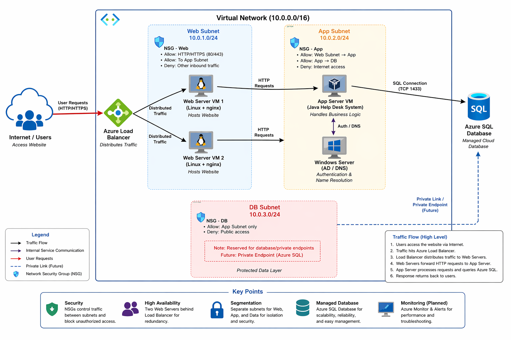
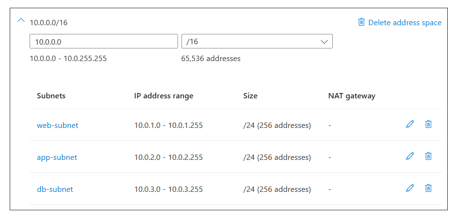
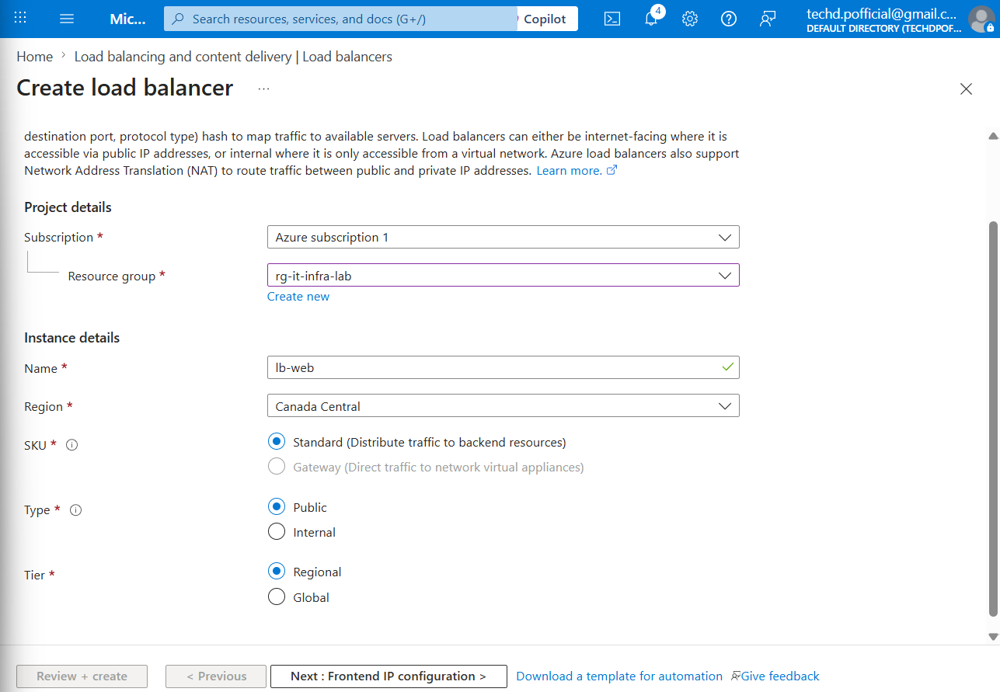
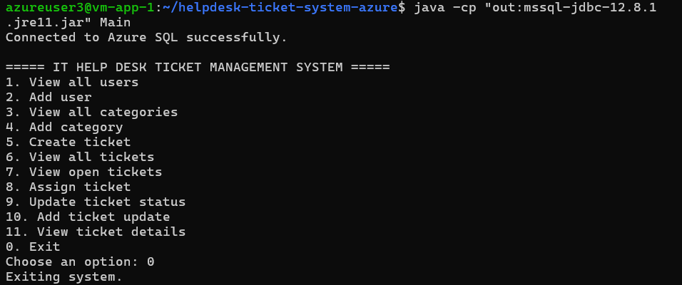
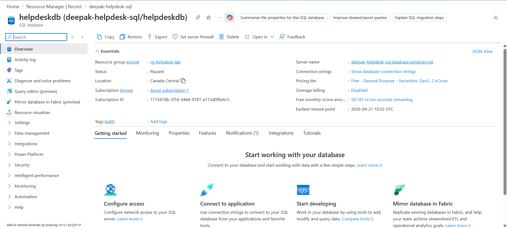
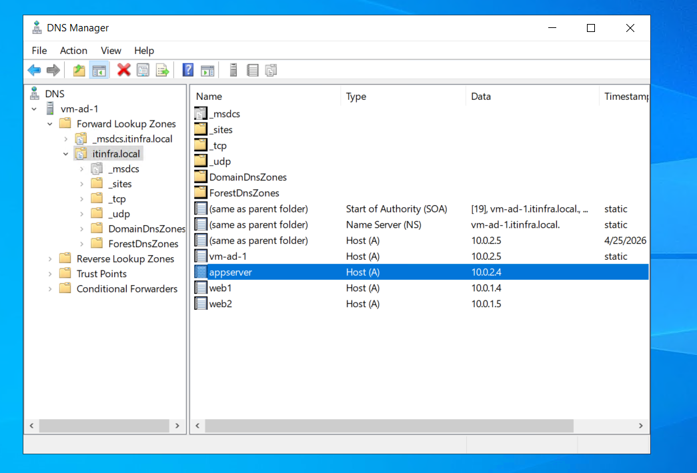
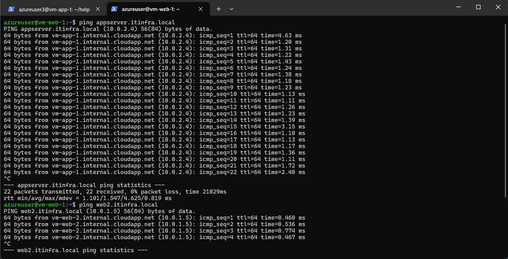
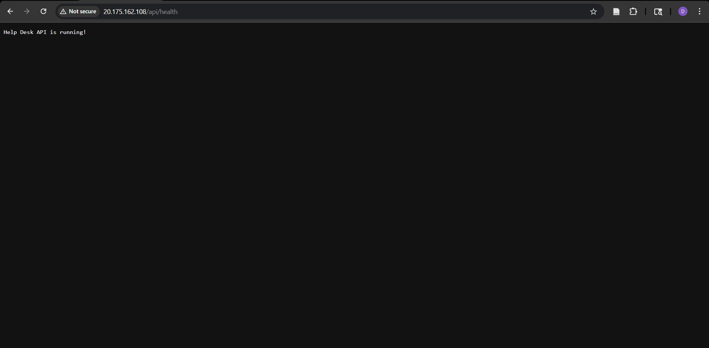
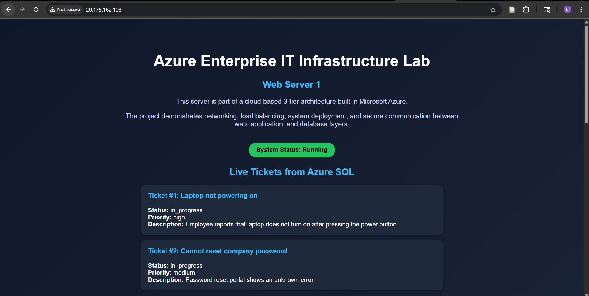
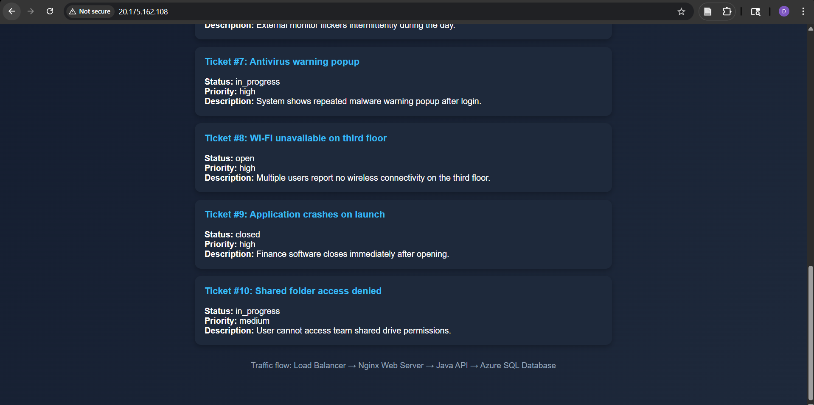

# Azure Enterprise Help Desk Infrastructure (3-Tier Cloud System)

---

## 🎯 Recruiter Summary

Built and deployed a **cloud-based 3-tier IT support system** on Microsoft Azure integrating:

* Azure Virtual Networks, Subnets, and NSGs
* Load-balanced nginx web servers (Linux)
* Java backend API (Help Desk system)
* Azure SQL Database
* Windows Server (DNS / domain services)
* End-to-end system integration with real data

This project demonstrates how modern enterprise systems connect **networking + backend + database + web interface** into a working solution.

---

## 📌 Project Overview

This project simulates a **real-world enterprise IT environment**.

Instead of deploying isolated components, the focus was on building a **fully connected system** where:

* Users access a web interface
* Requests flow through a load-balanced web layer
* A backend API processes requests
* Data is retrieved from a cloud database

Final system flow:

```text id="4k5w5q"
User → Load Balancer → Web Server → Java API → Azure SQL Database
```

---

## 🚀 What This Project Demonstrates

* End-to-end cloud architecture
* Network segmentation and security
* Load balancing and redundancy
* Backend API integration
* Database connectivity
* DNS-based internal communication
* Real-world troubleshooting

---

## 🧠 Architecture Diagram



---

## 🏗️ Architecture Overview

### 🔹 Web Layer

* Two Ubuntu VMs (`vm-web-1`, `vm-web-2`)
* Running nginx
* Behind Azure Load Balancer

### 🔹 Application Layer

* Java Help Desk system (`vm-app-1`)
* Exposes API endpoints

### 🔹 Data Layer

* Azure SQL Database

### 🔹 Identity & Networking

* Windows Server (DNS + domain services)
* Internal hostname-based communication

### 🔹 Security

* NSGs restrict traffic between layers

---

## 🔄 End-to-End Traffic Flow

```text id="21i7wi"
1. User opens browser
2. Request hits Azure Load Balancer
3. Routed to nginx web server
4. Nginx forwards /api requests to app server
5. Java API processes request
6. Data fetched from Azure SQL
7. Response returned to browser
```

---

## 🌐 Network Design (Proof)




---

## 💻 Web Layer (nginx)

### 🔹 Setup

```bash id="9br3zt"
sudo apt update
sudo apt install nginx -y
sudo systemctl start nginx
```

### 🔹 Role

* Entry point for users
* Reverse proxy to backend
* Load-balanced across servers

---

## ⚖️ Load Balancer



* Distributes traffic across web servers
* Ensures high availability

---

## 🧩 Backend System (Help Desk Application)

⚠️ This repository contains the **infrastructure setup**.

The backend application is here:

👉 https://github.com/mr-h4cker/helpdesk-ticket-system-azure

---

### 🔹 What it is

A Java-based Help Desk system that simulates:

* Ticket tracking
* Status updates
* Priority handling

---

### 🔹 Why it matters

Instead of dummy data:

```text id="fskwxf"
User → Ticket System → Database → API → Web UI
```

This makes the project **realistic and production-like**.

---

## 💻 Application Layer (Java API)

### 🔹 Deployment

```bash id="ts3j71"
git clone https://github.com/mr-h4cker/helpdesk-ticket-system-azure.git
cd helpdesk-ticket-system-azure
```

---

### 🔹 Compile & Run

```bash id="4d8c4l"
mkdir -p out
javac -cp "mssql-jdbc-12.8.1.jre11.jar" -d out $(find src -name "*.java")
java -cp "out:mssql-jdbc-12.8.1.jre11.jar" ApiServer
```

---

### 🔹 API Endpoints

```text id="g5b8km"
/api/health
/api/tickets
```

---

### 🔹 Proof



---

## 🗄️ Azure SQL Database



* Stores ticket data
* Managed cloud database

---

## 🪟 Windows Server (DNS & Domain Services)

### 🔹 What is used

* DNS actively used
* Domain services configured (not fully integrated yet)

---

### 🔹 DNS Setup

```text id="rqstl6"
appserver.itinfra.local
web1.itinfra.local
web2.itinfra.local
```

---

### 🔹 Proof





---

## 🔗 End-to-End Integration

### 🔹 Nginx Reverse Proxy

```nginx id="0r3rf6"
location /api/ {
    proxy_pass http://appserver.itinfra.local:8080/api/;
}
```

---

### 🔹 Full Flow Proof



---

## 🔥 Live Data Display (FINAL FEATURE)

### 🔹 What was built

The web interface dynamically loads ticket data from Azure SQL.

---

### 🔹 Flow

```text id="0bsvpm"
Browser → Web Server → API → Azure SQL
```

---

### 🔹 Output





---

### 🔹 Result

```text id="n0b4wz"
Static page ❌ → Dynamic system ✔
```

---

## 🛠️ Troubleshooting & Challenges

### 🔹 Azure SQL Firewall

* VM blocked from DB
* Fixed using public IP:

```bash id="4h0r7q"
curl ifconfig.me
```

---

### 🔹 DNS Misconfiguration

* Used public IP instead of private
* Fixed DNS records

---

### 🔹 JSON Issue

* Invalid API response
* Fixed JSON formatting

---

### 🔹 Nginx Proxy Issue

* 404 due to wrong path
* Fixed proxy_pass

---

## 📚 What I Learned

* How real cloud networks work
* Public vs private IP behavior
* Reverse proxy integration
* DNS importance in systems
* Debugging cloud deployments
* Connecting multiple layers together

---

## 🎯 Key Achievements

* Built full 3-tier system
* Integrated frontend, backend, and database
* Implemented real enterprise patterns
* Solved real-world cloud issues

---

## 🧰 Skills Demonstrated

* Azure Networking (VNet, NSG, Subnets)
* Linux (nginx, systemctl)
* Windows Server (DNS)
* Load Balancing
* Java Backend Development
* JDBC & SQL
* Cloud Troubleshooting

---

## 📸 Full Build Screenshots

All detailed step-by-step screenshots are available in the `/screenshots` folder.

---

## 🚀 Future Improvements

* Convert API to Spring Boot
* Add authentication (Active Directory)
* Use Private Endpoint for SQL
* Add monitoring

---

## 💬 Project Story

This project started as a simple Azure lab.

Instead of stopping there, it was extended into a **fully working system** by:

* Integrating a real backend application
* Connecting it to a cloud database
* Linking it to the web layer
* Displaying real data in the browser

This helped build a deeper understanding of how **real systems are designed and connected**, not just deployed.

---
