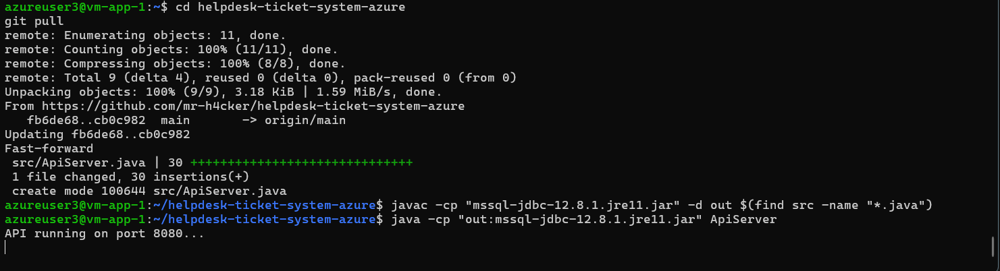
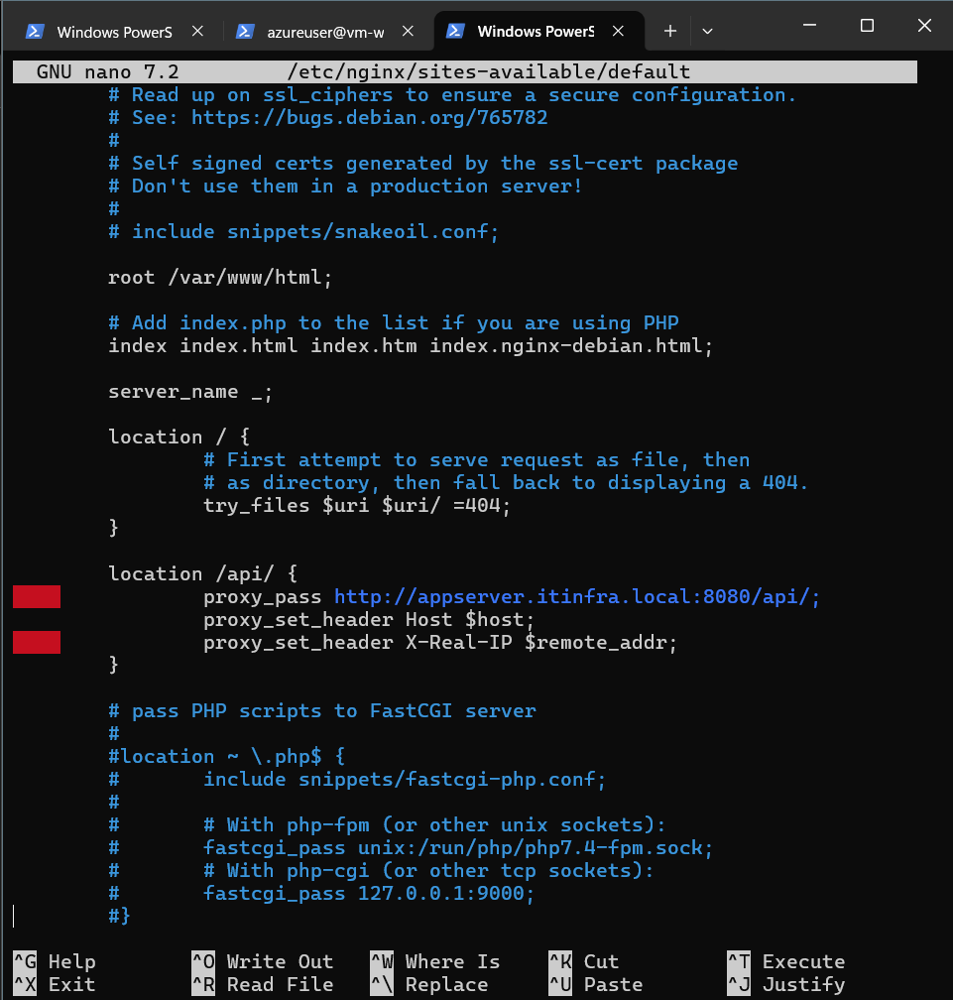

# Azure Enterprise IT Infrastructure Lab

## 📌 Overview

This project demonstrates the design and implementation of a **cloud-based enterprise IT infrastructure** using Microsoft Azure.

The goal was to simulate a real-world production environment by integrating:

* Networking
* Security
* Application deployment
* Database systems
* Identity services

The architecture follows a **3-tier design**:

```text
Web Layer → Application Layer → Data Layer
```

This ensures scalability, isolation, and maintainability — just like real enterprise systems.

---

## 🧠 Architecture Diagram


---

## 🏗️ Architecture Summary

* **Web Layer:**
  Two Linux VMs running nginx behind an Azure Load Balancer (high availability)

* **Application Layer:**
  Java-based Help Desk system running on a VM

* **Identity Services:**
  Windows Server providing Active Directory & DNS

* **Data Layer:**
  Azure SQL Database (managed cloud database)

* **Networking:**
  Virtual Network segmented into subnets (Web, App, DB)

* **Security:**
  Network Security Groups (NSGs) controlling traffic between layers

---

## 🌐 Network Configuration

### 🔹 Virtual Network

* Address Space: `10.0.0.0/16`


---

### 🔹 Subnets

* Web Subnet → `10.0.1.0/24`
* App Subnet → `10.0.2.0/24`
* DB Subnet → `10.0.3.0/24`


---

### 🔹 NSG Security Model

* Web → allows HTTP from Internet
* App → allows traffic only from Web
* DB → allows traffic only from App


---

## 💻 Web Layer (Nginx Servers)

Two Ubuntu VMs were deployed:

* `vm-web-1`
* `vm-web-2`

### 🔹 Setup

```bash
sudo apt update
sudo apt install nginx -y
sudo systemctl start nginx
```


---

### 🔹 Purpose

* Load balancing
* Redundancy
* Entry point for users

---

## ⚖️ Load Balancer

Azure Load Balancer distributes incoming traffic across both web servers.

### 🔹 Features

* Backend Pool → 2 web servers
* Health Probe → HTTP (port 80)
* Rule → Port 80 traffic distribution


---

## 💻 Application Layer (Java System)

### 🔹 Deployment

* VM: `vm-app-1`
* Installed Java:

```bash
sudo apt install openjdk-17-jdk -y
```

---

### 🔹 Run Application

```bash
javac -cp "mssql-jdbc-12.8.1.jre11.jar" -d out $(find src -name "*.java")
java -cp "out:mssql-jdbc-12.8.1.jre11.jar" Main
```


---

## 🗄️ Azure SQL Database

### 🔹 Purpose

* Persistent storage
* Managed cloud database
* Scalable and reliable

---

### 🔹 JDBC Connection

```java
jdbc:sqlserver://<server-name>.database.windows.net:1433;
```

---

## 🪟 Identity Services (AD & DNS)

### 🔹 Why it exists

In real enterprises:

* Systems don’t communicate via IP
* They use **hostnames + DNS**

---

### 🔹 Implementation

* Windows Server configured as DNS server
* Records created:

```text
appserver.itinfra.local
web1.itinfra.local
web2.itinfra.local
```

---

### 🔹 Result

* Clean internal communication
* Real enterprise-style networking

---

## 🔗 End-to-End Application Integration

### 🔹 Final System Flow

```text
User → Load Balancer → Web Server (nginx)
→ Java API → Azure SQL Database
```

---

### 🔹 Java API Server

A lightweight HTTP API was added to expose backend functionality.

```bash
java -cp "out:mssql-jdbc-12.8.1.jre11.jar" ApiServer
```



---

### 🔹 Reverse Proxy (Nginx)

```nginx
location /api/ {
    proxy_pass http://appserver.itinfra.local:8080/api/;
}
```

This connects the web layer to the application layer.



---

### 🔹 Full Flow Test


---

## 🔥 Live Data Display (FINAL UPGRADE)

### 🔹 What was added

The web interface was upgraded to fetch real-time data from the backend API.

---

### 🔹 Flow

```text
Browser → Web Server → API → Azure SQL
```

---

### 🔹 Implementation

* `/api/tickets` returns JSON from database
* JavaScript `fetch()` used in frontend
* Data rendered dynamically

---

### 🔹 Output


---

### 🔹 Result

* Web page is no longer static
* Displays real database records
* Full 3-tier architecture working end-to-end

---

## 🛠️ Troubleshooting & Challenges

### 🔹 Azure SQL Firewall Issue

* VM could not access database

**Fix:**

```bash
curl ifconfig.me
```

Added VM IP to Azure firewall.

---

### 🔹 DNS Issue

* Used public IP instead of private

**Fix:**

* Switched to private IP
* Verified using `ping`

---

### 🔹 JSON Parsing Issue

* API returned invalid JSON

**Fix:**

* Corrected closing bracket `]` in response

---

### 🔹 Nginx Proxy Issue

* 404 error due to incorrect path

**Fix:**

```nginx
proxy_pass http://appserver.itinfra.local:8080/api/;
```

---

## 🎯 Objectives Achieved

* Built full 3-tier cloud architecture
* Integrated networking, security, and application layers
* Connected frontend → backend → database
* Simulated real enterprise deployment

---

## 🧰 Skills Demonstrated

* Azure Networking (VNet, Subnets, NSG)
* Linux Administration (nginx, systemctl)
* Windows Server (DNS, AD)
* Load Balancing
* Java Backend Development
* JDBC Database Integration
* Azure SQL
* Cloud Troubleshooting

---

## 🚀 Future Improvements

* Convert API to Spring Boot
* Add authentication (AD integration)
* Use Private Endpoint for SQL
* Add monitoring (Azure Monitor)

---
