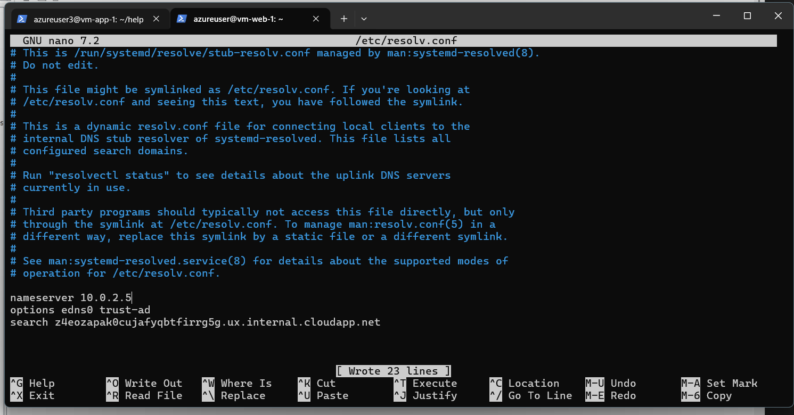

# Azure Enterprise IT Infrastructure Lab

## 📌 Overview

This project demonstrates the design and implementation of a cloud-based enterprise IT infrastructure using Microsoft Azure. The goal is to simulate a real-world environment that includes networking, system deployment, security, and application integration.

The architecture follows a 3-tier design with separate web, application, and data layers to ensure scalability, security, and maintainability.

---

## 🧠 Architecture Diagram


---

## 🏗️ Architecture Summary

* **Web Layer:** Two Linux-based virtual machines running nginx behind an Azure Load Balancer for high availability
* **Application Layer:** Java-based Help Desk system hosted on a virtual machine
* **Identity Services:** Windows Server with Active Directory and DNS for internal infrastructure services
* **Data Layer:** Azure SQL Database for managed and scalable data storage
* **Networking:** Segmented Virtual Network with dedicated subnets and Network Security Groups (NSGs)
* **Security:** Controlled traffic flow between layers using NSG rules

---

## 🌐 Network Configuration

### 🔹 Virtual Network Creation

A Virtual Network (VNet) was created to simulate a private enterprise network in Azure.

* Address space: **10.0.0.0/16**


---

### 🔹 Subnet Configuration

The network was divided into three subnets:

* **Web Subnet (10.0.1.0/24)** → Public-facing web layer
* **App Subnet (10.0.2.0/24)** → Internal application services
* **DB Subnet (10.0.3.0/24)** → Protected data layer


---

### 🔹 Network Security Groups (NSGs)

Network Security Groups were configured to control traffic between layers.


---

### 🔹 Security Rules

* Web subnet allows HTTP traffic from the internet
* App subnet allows traffic only from the web subnet
* DB subnet allows traffic only from the application subnet


---

### 🔹 NSG Association

Each NSG was linked to its respective subnet.


---

## 💻 Web Server Deployment

### 🔹 Virtual Machines

Two Ubuntu servers were deployed:

* vm-web-1
* vm-web-2


---

### 🔹 Install Nginx

```bash
sudo apt update
sudo apt install nginx -y
sudo systemctl start nginx
sudo systemctl enable nginx
```


---

### 🔹 Custom Web Interface

Each server displays a unique page:

* Web Server 1 → primary
* Web Server 2 → redundancy


---

### 🔹 Purpose

* Enables load balancing
* Provides redundancy
* Simulates production environment

---

## ⚖️ Load Balancer Configuration

### 🔹 Overview

Azure Load Balancer distributes traffic across both web servers.


---

### 🔹 Backend Pool

* vm-web-1
* vm-web-2


---

### 🔹 Health Probe

* HTTP
* Port 80


---

### 🔹 Load Balancing Rule

Traffic on port 80 is balanced across servers.


---

### 🔹 Testing

Refreshing shows different servers responding.


---

## 💻 Application Layer Deployment

### 🔹 Setup

Application server deployed in App Subnet:

* vm-app-1
* Ubuntu Server


---

### 🔹 Install Java

```bash
sudo apt update
sudo apt install openjdk-17-jdk -y
java -version
```


---

### 🔹 Deploy Project

```bash
git clone https://github.com/mr-h4cker/helpdesk-ticket-system-azure.git
cd helpdesk-ticket-system-azure

wget https://repo1.maven.org/maven2/com/microsoft/sqlserver/mssql-jdbc/12.8.1.jre11/mssql-jdbc-12.8.1.jre11.jar
```


---

### 🔹 Compile & Run

```bash
mkdir -p out
javac -cp "mssql-jdbc-12.8.1.jre11.jar" -d out $(find src -name "*.java")
java -cp "out:mssql-jdbc-12.8.1.jre11.jar" Main
```


---

### 🔹 Success

Application connects to Azure SQL and runs successfully.


---

## 🪟 Identity Services (Active Directory & DNS)

### 🔹 Overview

A Windows Server VM was deployed to simulate enterprise identity and internal DNS services.

---

### 🔹 DNS Integration

Internal DNS was configured to allow communication using hostnames instead of IP addresses.

* `appserver.itinfra.local`
* `web1.itinfra.local`
* `web2.itinfra.local`


---

### 🔹 Linux DNS Configuration

The application server was configured to use the Windows Server as its DNS resolver.



---

### 🔹 DNS Resolution Testing

Connectivity was verified using hostnames.


---

### 🔹 Note on Azure SQL

Azure SQL is accessed using its FQDN:

```
<server-name>.database.windows.net
```

---

### 🔹 Purpose

* Provides internal name resolution
* Simulates enterprise DNS
* Enables hostname-based communication

---

## 🛠️ Troubleshooting & Challenges

### 🔹 JDBC Driver Issue

The application initially failed due to missing JDBC driver.

---

### 🔹 Azure SQL Firewall Issue

Application could not connect due to blocked IP.


**Fix:**
Used:

```bash
curl ifconfig.me
```

Added VM IP to Azure firewall.

---

### 🔹 DNS Configuration Issue

Initially used public IPs in DNS records.

**Issue:**

* Name resolved
* Connection failed

**Fix:**

* Switched to private IPs
* Verified with:

```bash
ping appserver.itinfra.local
```

---

### 💡 Key Learnings

* DNS resolution ≠ connectivity
* Private IPs are required for internal communication
* Cloud firewall rules must be configured correctly
* Debugging is a key part of real deployments

---

## 🗄️ Azure SQL Database Integration

### 🔹 Overview

Azure SQL was used as the data layer.


---

### 🔹 Firewall Configuration


---

### 🔹 JDBC Integration

```java
jdbc:sqlserver://<server-name>.database.windows.net:1433;
```

---

### 🔹 Purpose

* Provides persistent storage
* Separates data layer from application
* Simulates real cloud database usage

---

## 🎯 Objectives

* Simulate enterprise IT infrastructure
* Apply networking and security concepts
* Deploy real applications in cloud
* Implement high availability architecture

---

## 🧰 Skills Demonstrated

* Azure Networking (VNet, Subnets, NSG)
* Linux Server Administration
* Windows Server (AD & DNS)
* Load Balancing & High Availability
* Java Deployment & Debugging
* JDBC & Database Connectivity
* Azure SQL Database
* Cloud Troubleshooting

---

## 🚀 Future Improvements

* Convert Help Desk CLI into web-based application (Spring Boot API)
* Integrate web layer with application layer
* Implement Azure Private Endpoint for SQL
* Add monitoring and alerting

---
